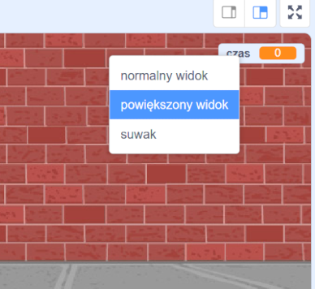

## Dodaj licznik czasu

Możesz uczynić swoją grę bardziej interesującą, dając graczowi 10 sekund na przebicie jak największej liczby balonów.

--- task ---

Możesz użyć innej zmiennej do przechowywania pozostałego czasu. Kliknij na scenie i utwórz nową zmienna nazwaną `czas`{:class="block3variables"}.

--- /task ---

Twój licznik czasu powinien działać następująco:

+ Licznik czasu powinien zaczynać od 10 sekund;
+ Licznik powinien zmniejszać się co sekundę;
+ Gra powinna się zatrzymać, gdy licznik czasu osiągnie 0.

--- task ---

Oto kod do zrobienia tego, który możesz dodać do swojej _sceny_:


```blocks3
when flag clicked
set [czas v] to [10]
repeat until <(czas) = [0]>
    wait (1) seconds
    change [czas v] by (-1)
end
stop [wszystko v]
```

--- /task ---

--- task ---

Przeciągnij swoją wyświetloną zmienną 'czas' na prawą stronę sceny. Możesz także kliknąć prawym przyciskiem myszy na wyświetlaną zmienną i wybrać "powiększony widok", aby zmienić sposób wyświetlania czasu.



--- /task ---

--- task ---

Przetestuj swoją grę. Ile punktów możesz zdobyć? Jeśli Twoja gra jest zbyt łatwa, możesz:

+ Dać graczowi mniej czasu;
+ Zwiększyć liczbę balonów;
+ Sprawić, aby balony poruszały się szybciej;
+ Sprawić aby balony były mniejsze.

Zagraj w grę kilka razy, aż będziesz zadowolony, że jest to odpowiedni poziom trudności.

--- /task ---

