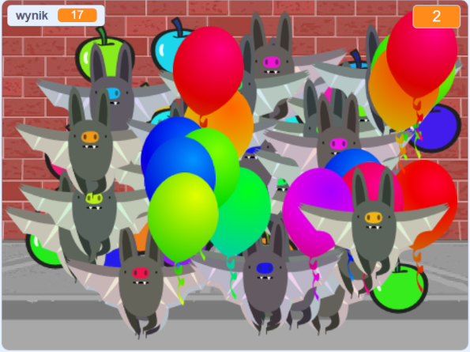

## Wyzwanie: Więcej obiektów
Czy możesz dodać inne obiekty do swojej gry? Możesz dodawać dobre przedmioty, takie jak pączki, które dają ci wiele punktów, lub złe przedmioty, takie jak nietoperze, które odbierają punkty.

Musisz pomyśleć o dodawanych obiektach. Zastanów się nad:

+ Ile ich będzie?
+ Jak duże będą? Jak będą się poruszać?
+ Ile punktów zdobędziesz (lub stracisz) za kliknięcie ich?
+ Czy będzie poruszał się szybciej czy wolniej niż balony?
+ Jak będą wyglądać / brzmieć po kliknięciu?

Jeśli potrzebujesz pomocy przy dodawaniu innego obiektu, możesz skorzystać z poprzednich kroków!

