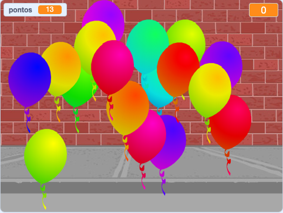

--- no-print ---

Esta é a versão **Scratch 3** do projeto. Existe também uma [versão Scratch 2 do projeto](https://projects.raspberrypi.org/pt-BR/projects/balloons-scratch2).

--- /no-print ---

## Introdução

Você vai fazer um jogo de estourar balões!

### O que você vai fazer

--- no-print ---

Estoure os balões clicando neles.

  <iframe allowtransparency="true" width="485" height="402" src="https://scratch.mit.edu/projects/embed/411754070/?autostart=false" frameborder="0" scrolling="no"></iframe>
  

--- /no-print ---

--- print-only ---

--- /print-only ---

--- collapse ---
---
title: O que você vai precisar
---

### Hardware

+ Um computador capaz de executar o Scratch

### Software

+ Scratch 3 ([online](http://rpf.io/scratchon){:target="_blank"} ou [offline](http://rpf.io/scratchoff){:target="_blank"})

--- /collapse ---

--- collapse ---
---
title: O que você vai aprender
---

- Como usar animação para mover atores
- Como usar números aleatórios
- Como desenhar atores
- Como criar clones de um ator

--- /collapse ---

--- collapse ---
---
título: Informações adicionais para educadores
---

--- no-print ---

Se você precisar imprimir este projeto, por favor, use a [versão para impressão](https://projects.raspberrypi.org/pt-BR/projects/balloons/print){:target="_blank"}.

--- /no-print ---

Você pode encontrar o [projeto concluído aqui](http://rpf.io/p/pt-BR/balloons-get){:target="_blank"}.

--- /collapse ---
