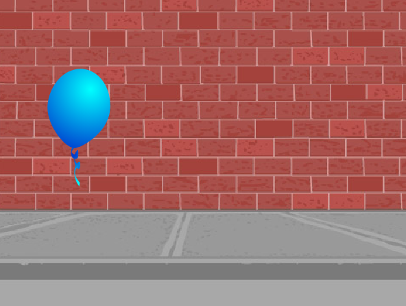
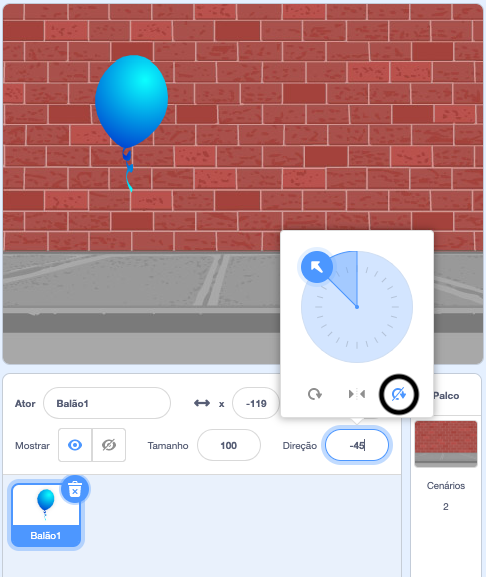

## Animando um balão

--- task ---

Abra um novo projeto Scratch.

**Online**: abra um [novo projeto online Scratch](http://rpf.io/scratch-new){:target="_ blank"}.

Se você tiver uma conta Scratch, você pode fazer uma cópia clicando em **Remix**.

**Offline**: abra um novo projeto no editor offline.

Se você precisar baixar e instalar o editor offline do Scratch, você pode encontrá-lo em [rpf.io/scratchoff](http://rpf.io/scratchoff){:target="_blank"}.

--- /task ---

--- task ---

Apague o ator gato.

--- /task ---

--- task ---

Adicione um novo ator balão e um cenário de palco adequado.



--- /task ---


--- task ---

Adicione este código ao seu balão, para que ele salte pela tela:


```blocks3
    when flag clicked
    go to x:(0) y:(0)
    point in direction (45 v)
    forever
        move (1) steps
        if on edge, bounce
    end
```

--- /task ---

--- task ---

Teste seu balão. Ele se move muito devagar? Mude os números no seu código, se você quiser acelerar um pouco.

--- /task ---

--- task ---

Você também percebeu que seu balão vira enquanto se move pela tela?


Balões não se movem assim! Para corrigir isso, clique no ícone do ator balão e clique em Direção.

Na seção 'estilo de rotação', clique em 'Não gire' para interromper a rotação do balão.



--- /task ---

--- task ---

Teste seu programa novamente para verificar se o problema foi corrigido.

--- /task ---
