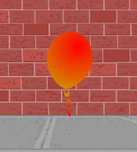

## Balões aleatórios

--- task ---

Com o código que você tem agora, seu balão sempre começará no mesmo lugar e se moverá no mesmo caminho.

Clique na bandeira algumas vezes para iniciar seu programa e você verá sempre o mesmo.

--- /task ---

--- task ---

Ao invés de cada vez usar a mesma posição x e y, em vez disso, você pode deixar o Scratch `escolher um número aleatório`{:class="blockoperators"}. Mude o código do seu balão, para que fique assim:


```blocks3
    when flag clicked
    go to x:(pick random (-150) to (150)) y:(pick random (-150) to (150))
    point in direction (45 v)
    forever
        move (1) steps
        if on edge, bounce
    end
```

Se você clicar na bandeira verde algumas vezes, observe que a cada vez seu balão começa em um local diferente.

--- /task ---

--- task ---

Você pode até usar um número aleatório para escolher a cada vez uma cor aleatória de balão:



--- hints ---

--- hint ---

`Mude o efeito cor`{:class="block3looks"} por um `número aleatório`{:class="block3operators"} quando a `bandeira verde for clicada`{:class="block3events"}.

--- /hint ---

--- hint ---

Você precisará adicionar esses blocos ao seu código.

```blocks3
(pick random (0) to (200)

change [colour v] effect by (25)
```

--- /hint ---

--- hint ---

Your code should look like this:


```blocks3
    when flag clicked
    go to x:(pick random (-150) to (150)) y:(pick random (-150) to (150))
    point in direction (45 v)
    change [colour v] effect by (pick random (0) to (200))
    forever
        move (1) steps
        if on edge, bounce
    end
```

--- /hint ---


--- /hints ---

--- /task ---

O que acontece se esse código for colocado no início do seu programa? Acontece algo diferente se você colocar esse código _dentro_ do loop `sempre`{:class="block3control"}? Qual você prefere?
