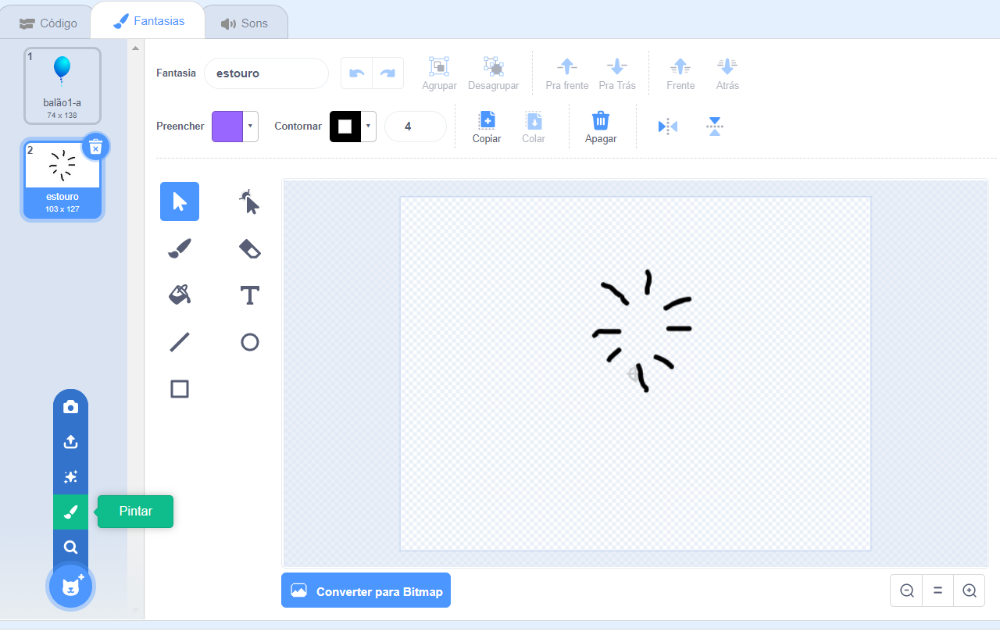

## Estourando balões

Vamos permitir que o jogador estoure os balões!

--- task ---

Clique no seu ator balão e clique na aba **Fantasias**. Você pode apagar todos as outras fantasias, deixando apenas 1 fantasia de balão. Adicione uma nova fantasia clicando em **Pintar nova fantasia** e crie uma nova fantasia chamada `estouro`.



--- /task ---

--- task ---

Certifique-se de que seu balão mude para a fantasia certa quando o jogo começar. Seu código agora deve ficar assim:


```blocks3
when flag clicked
+switch costume to (balloon1-a v)
point in direction (pick random (-90) to (180))
go to x:(pick random (-150) to (150)) y:(pick random (-150) to (150))
change [color v] effect by (pick random (0) to (200))
forever
    move (1) steps
    if on edge, bounce
end
```

--- /task ---

--- task ---

Para permitir ao jogador estourar um balão, adicione este código:


```blocks3
    when this sprite clicked
    switch costume to (burst v)
    start sound (pop v)
```

--- /task ---

--- task ---

Teste seu projeto. Você pode estourar o balão? É o que você esperava?

Você precisará melhorar esse código para que, quando o balão for clicado, ele mostre a fantasia `estouro` por um curto período de tempo, e é então escondido.

Você pode fazer tudo isso acontecer mudando o código do balão `quando este ator for clicado`{:class="block3events"} para isso:


```blocks3
when this sprite clicked
switch costume to (burst v)
start sound (pop v)
+ wait (0.3) seconds
+ hide
```

--- /task ---

--- task ---

Agora que você está apagando o balão quando ele é clicado, também precisa adicionar um bloco `mostre`{:class="block3looks"} para o início do código `quando ⚑ for clicada`{:class="block3events"}.


```blocks3
when flag clicked
+ show
switch costume to (balloon1-a v)
point in direction (pick random (-90) to (180))
```

--- /task ---

--- task ---

Tente estourar um balão novamente para verificar se ele funciona corretamente.

--- /task ---
