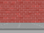
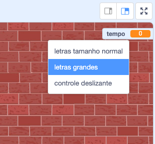

## Adicionando um cronômetro

Você pode tornar seu jogo mais interessante, dando apenas 10 segundos ao jogador para estourar o maior número possível de balões.

--- task ---

Você pode usar outra variável para armazenar o tempo restante. Clique no palco e crie uma nova variável chamada `tempo`{:class="block3variables"}.

--- /task ---

É assim que o cronômetro deve funcionar:

+ O cronômetro deve começar em 10 segundos;
+ O cronômetro deve contar a cada segundo (contagem regressiva);
+ O jogo deve parar quando o cronômetro chegar a 0.

--- task ---

Aqui está o código para fazer isso, que você pode adicionar ao seu _palco_:



```blocks3
when flag clicked
set [tempo v] to [10]
repeat until <(tempo :: variables) = [0]>
    wait (1) seconds
    change [tempo v] by (-1)
end
stop [all v]
```

--- /task ---

--- task ---

Arraste a exibição da variável 'tempo' para o lado direito do palco. Você também pode clicar com o botão direito do mouse na exibição da variável e escolher 'letras grandes' para alterar como o tempo é exibido.



--- /task ---

--- task ---

Teste seu jogo. Quantos pontos você consegue marcar? Se o seu jogo estiver muito fácil, você pode:

+ Dar ao jogador menos tempo;
+ Ter mais balões;
+ Fazer os balões se moverem mais rápido;
+ Fazer os balões menores.

Jogue seu jogo algumas vezes até ficar satisfeito com o nível certo de dificuldade.

--- /task ---

