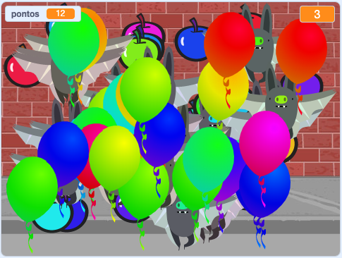

## Desafio: Mais objetos
Você pode adicionar outros objetos ao seu jogo? Você pode adicionar objetos bons, como rosquinhas, que dão muitos pontos, ou objetos ruins, como morcegos, que tiram pontos.

Você precisará pensar nos objetos que vai adicionar. Pense a respeito:

+ Quantos objetos vai ter?
+ O objeto vai ser grande? Como ele se move?
+ Quantos pontos você marcará (ou perderá) ao clicar nele?
+ Vai se mover mais rápido ou mais devagar que os balões?
+ Como será a aparência e o som quando ele for clicado?

Se precisar de ajuda para adicionar outro objeto, você pode reutilizar as etapas anteriores!

