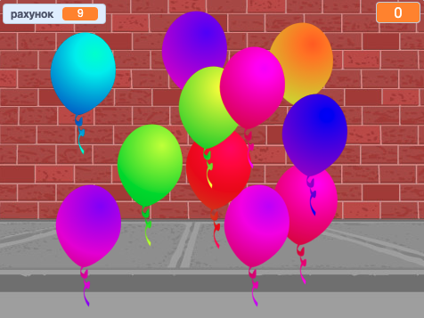

--- no-print ---

Це — версія проєкту для **Скретч 3**. Також існує [версія проєкту для Скретч 2](https://projects.raspberrypi.org/en/projects/balloons-scratch2).

--- /no-print ---

## Вступ

Ти зробиш гру із лопанням кульок!

### Що ти зробиш

--- no-print ---

Лопай кульки, клікаючи на них.

  <iframe allowtransparency="true" width="485" height="402" src="https://scratch.mit.edu/projects/embed/394088497/?autostart=false" frameborder="0" scrolling="no"></iframe>
  

--- /no-print ---

--- print-only ---

--- /print-only ---

--- collapse ---
---
title: Що тобі знадобиться
---

### Обладнання

+ Комп'ютер, що підтримує Скретч

### Програмне забезпечення

+ Скретч 3 (або [онлайн](http://rpf.io/scratchon){:target="_blank"}, або [офлайн](http://rpf.io/scratchoff){:target="_blank"})

--- /collapse ---

--- collapse ---
---
title: Чого ти навчишся
---

- Як використовувати анімацію, щоб змусити спрайти рухатися
- Як використовувати випадкові числа
- Як малювати спрайти
- Як створювати клони спрайтів

--- /collapse ---

--- collapse ---
---
title: Додаткова інформація для викладачів
---

--- no-print ---

Якщо вам потрібно роздрукувати цей проєкт, будь ласка, скористайтеся [версією для друку](https://projects.raspberrypi.org/uk-UA/projects/balloons/print){:target="_blank"}.

--- /no-print ---

Ви можете знайти [завершений проєкт тут](http://rpf.io/p/uk-UA/balloons-get){:target="_blank"}.

--- /collapse ---
