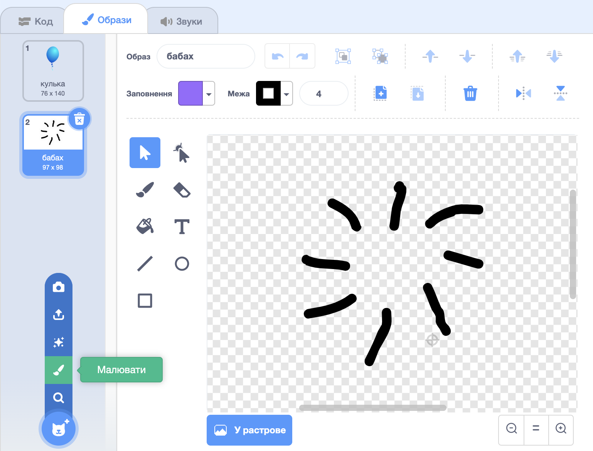

## Лопання кульок

Давай надамо гравцеві можливість лопати кульки!

--- task ---

Клацни на спрайт кульки, а потім перейди у вкладку **Образи**. Ти можеш залишити тільки 1 образ кульки, видаливши всі інші. Якщо хочеш, можеш перейменувати його на "кулька". Додай новий образ, клацнувши на **Малювати**, і створи новий костюм із назвою `бабах`.



--- /task ---

--- task ---

Переконайся в тому, що твоя кулька перемикаєтсья на правильний образ на початку гри. Тепер твій код має виглядати так:


```blocks3
when flag clicked
+switch costume to (кулька v)
point in direction (pick random (-90) to (180))
go to x:(pick random (-150) to (150)) y:(pick random (-150) to (150))
change [color v] effect by (pick random (0) to (200))
forever
    move (1) steps
    if on edge, bounce
end
```

--- /task ---

--- task ---

Щоб дати гравцеві можливість лопати кульку, додай наступний код:


```blocks3
    when this sprite clicked
    switch costume to (бабах v)
    start sound (pop v)
```

--- /task ---

--- task ---

Перевір свій проєкт. Чи можеш ти лопнути кульку? Чи все працює як слід?

Тобі треба буде вдосконалити код, щоб при натисканні на кульку протягом короткого часу відображався образ `бабах`, після чого кулька ховалася.

Ти можеш реалізувати усе це, змінивши код `коли спрайт натиснуто`{:class="block3events"} таким чином:


```blocks3
when this sprite clicked
switch costume to (бабах v)
start sound (pop v)
+ wait (0.3) seconds
+ hide
```

--- /task ---

--- task ---

Тепер, коли ти почав (-ла) видаляти кульку після натискання на неї, тобі також треба додати блок `показати`{:class="block3looks"} на початку фрагменту `коли зелений прапор натиснуто`{:class="block3events"}.


```blocks3
when flag clicked
+ show
switch costume to (кулька v)
point in direction (pick random (-90) to (180))
```

--- /task ---

--- task ---

Спробуй лопнути кульку іще, щоб перевірити, що все працює як слід.

--- /task ---
