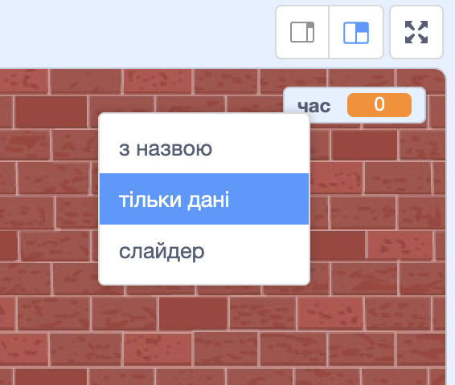

## Додавання таймера

Ти можеш зробити гру іще цікавішою, надаючи гравцеві лише 10 секунд для того, щоб лопнути якомога більше кульок.

--- task ---

Ти можеш використати ще одну змінну для зберігання залишку часу. Клацни на сцену і створи нову змінну `час`{:class="block3variables"}.

--- /task ---

Твій таймер має працювати так:

+ Він повинен починати із 10 секунд;
+ Він повинен робити зворотній відлік кожну секунду;
+ Гра має зупинитись, коли таймер дійде до 0.

--- task ---

Ось код, який може це робити, і який ти можеш додати до своєї _сцени_:


```blocks3
when flag clicked
set [time v] to [10]
repeat until <(time) = [0]>
    wait (1) seconds
    change [time v] by (-1)
end
stop [all v]
```

--- /task ---

--- task ---

Перетягни відображення змінної "час" в праву частину сцени. Також ти можеш клацнути правою кнопкою мишки по відображенню цієї змінної і вибрати "тільки дані", щоб змінити спосіб відображення часу.



--- /task ---

--- task ---

Протестуй свою гру. Скільки очок ти можеш набрати? Якщо гра занадто проста, ти можеш:

+ Давати гравцю менше часу;
+ Зробити більше кульок;
+ Зробити, щоб кульки рухалися швидше;
+ Зробити кульки меншими.

Зіграй в свою гру декілька разів, поки не будеш задоволений рівнем складності.

--- /task ---

