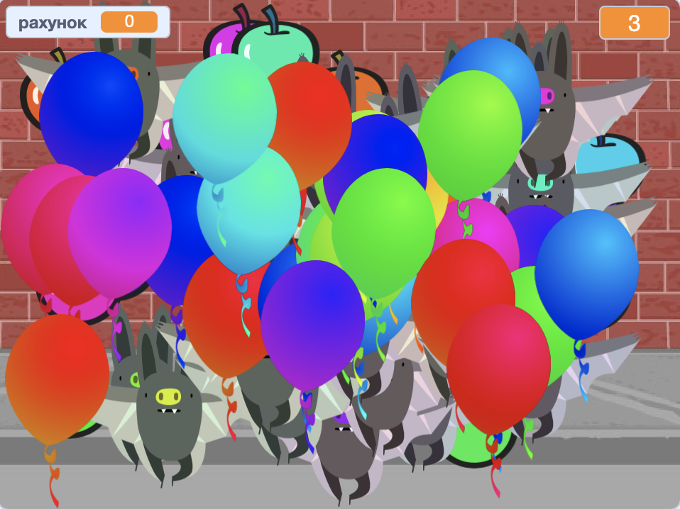

## Завдання: більше об’єктів
Чи можеш ти додати інші об’єкти до своєї гри? Ти можеш додавати як хороші об’єкти, наприклад, пончики, що дають тобі багато очок, так і погані, наприклад, летючі миші, які очки забирають.

Тобі треба поміркувати про об’єкти, які ти додаватимеш. Подумай про наступне:

+ Скільки їх буде?
+ Який їх розмір? Як вони рухатимуться?
+ Скільки очок ти будеш отримувати (або втрачати), якщо натискатимеш на них?
+ Чи будуть вони рухатися швидше або повільніше ніж кульки?
+ Як вони виглядатимуть чи звучатимуть, коли на них натискати?

Якщо тобі потрібна допомога, щоб додати іще один об’єкт, то можеш повторно використати попередні кроки!

