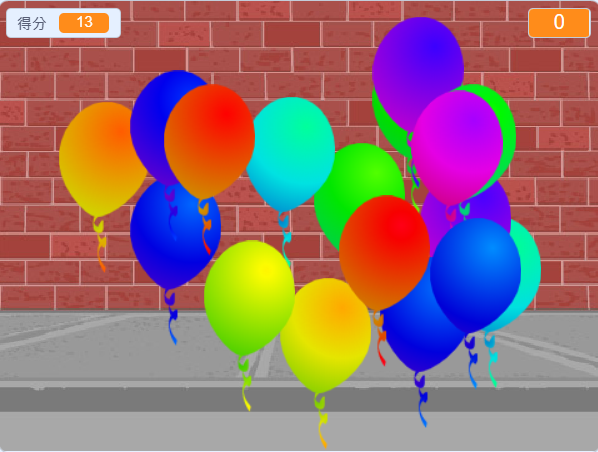

--- no-print ---

這個專案是 **Scratch 3** 版本。 另外還有 [Scratch 2](https://projects.raspberrypi.org/zh-TW/projects/balloons-scratch2) 版本。

--- /no-print ---

## 介紹

你將製作一個氣球射擊遊戲！

### 你將會做出

--- no-print ---

通過點擊氣球來射擊他們

  <iframe allowtransparency="true" width="485" height="402" src="https://scratch.mit.edu/projects/embed/416394847/?autostart=false" frameborder="0" scrolling="no"></iframe>
  

--- /no-print ---

--- print-only ---

--- /print-only ---

--- collapse ---
---
title: 你會需要用到
---

### 硬體

+ 可運行Scratch 的電腦

### 軟體

+ Scratch 3（[線上版](http://rpf.io/scratchon){:target="_blank"} 或 [離線版](http://rpf.io/scratchoff){:target="_blank"}）

--- /collapse ---

--- collapse ---
---
title: 你將會學到
---

- 如何用動畫讓角色移動
- 如何使用隨機數
- 如何繪製角色
- 如何複製角色

--- /collapse ---

--- collapse ---
---
title: 給教師的其它資訊
---

--- no-print ---

如果你需要列印此專案，請使用[友善列印](https://projects.raspberrypi.org/zh-TW/projects/balloons/print){:target="_blank"}。

--- /no-print ---

你可以在這裡找到[已經完成的專案](http://rpf.io/p/zh-TW/balloons-get){:target="_blank"}。

--- /collapse ---
