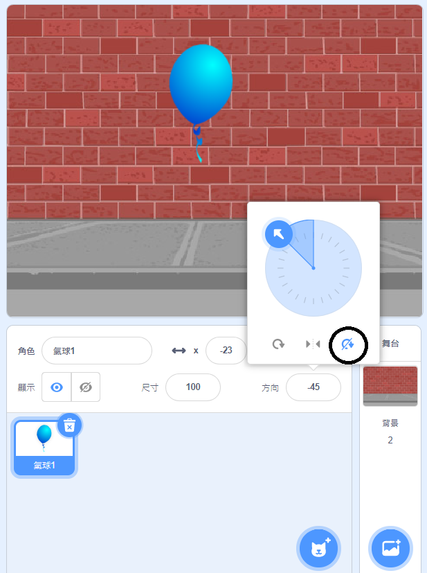

## 讓氣球動起來

--- task ---

建立一個新的 Scratch 專案。

**線上版**: 開啟一個 [新的線上Scratch專案](http://rpf.io/scratch-new){:target="_blank"}.

如果你有 Scratch 帳戶，你可以直接複製透過點擊**Remix**。

**離線版**: 在離線編輯器開啟新專案。

如果你需要 Scratch 離線版編輯器，可以連結到 [rpf.io/scratchoff](http://rpf.io/scratchoff){:target="_blank"}。

--- /task ---

--- task ---

刪除貓角色

--- /task ---

--- task ---

增加一個新的氣球角色，還有一個合適的舞台背景。


--- /task ---


--- task ---

將此代程式碼增加到你的氣球中，使它在螢幕上彈動：


```blocks3
    when flag clicked
    go to x:(0) y:(0)
    point in direction (45 v)
    forever
        move (1) steps
        if on edge, bounce
    end
```

--- /task ---

--- task ---

測試你的氣球。 它移動的太慢了嗎？ 如果你要稍微加速它，更改你程式碼中的數字。

--- /task ---

--- task ---

您還注意到你的氣球在屏幕上移動時會翻轉嗎？


氣球不會像這樣移動！ 要解決此問題，點擊氣球角色的圖示，然後點擊方向。

在“旋轉樣式”部分，點擊“不旋轉”來停止氣球旋轉。



--- /task ---

--- task ---

再次測試你的程式，看問題是否解決。

--- /task ---
