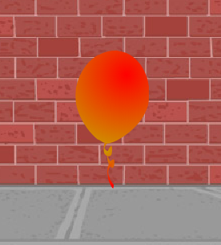

## 隨機氣球

--- task ---

用現在你有的的代碼，你的氣球將始終在同一位置開始並在同一路徑中移動。

點擊旗子數次來開始程式,你會看到每次都是相同的。

--- /task ---

--- task ---

與其每次都用相同的x和y位置,你可以使Scratch `選擇一隨機數`{:class="blockoperators"}。 更改你氣球的程式碼，使其如下所示：


```blocks3
    when flag clicked
    go to x:(pick random (-150) to (150)) y:(pick random (-150) to (150))
    point in direction (45 v)
    forever
        move (1) steps
        if on edge, bounce
    end
```

如果你點擊幾次綠色旗子，你應該會注意到你的氣球每次都在不同的地方開始。

--- /task ---

--- task ---

你甚至可以每次使用隨機數來選擇一個任意的氣球顏色：



--- hints ---

--- hint ---

`改變顏色效果透過`{:class="block3looks"}藉由一個 `隨機數`{:class="block3operators"}當`綠色旗子被點擊時`{:class="block3events"}.

--- /hint ---

--- hint ---

你將需要添加這些代碼塊到你的代碼中：

```blocks3
(pick random (0) to (200)

change [colour v] effect by (25)
```

--- /hint ---

--- hint ---

Your code should look like this:


```blocks3
    when flag clicked
    go to x:(pick random (-150) to (150)) y:(pick random (-150) to (150))
    point in direction (45 v)
    change [colour v] effect by (pick random (0) to (200))
    forever
        move (1) steps
        if on edge, bounce
    end
```

--- /hint ---


--- /hints ---

--- /task ---

如果將此程式碼放在你程式的開頭會怎樣？ 任何不一樣的事會發生嗎?如果你把這程式碼放在 `重複無限次`{:class="block3control"} 迴圈_內部_? 你喜歡哪個？
