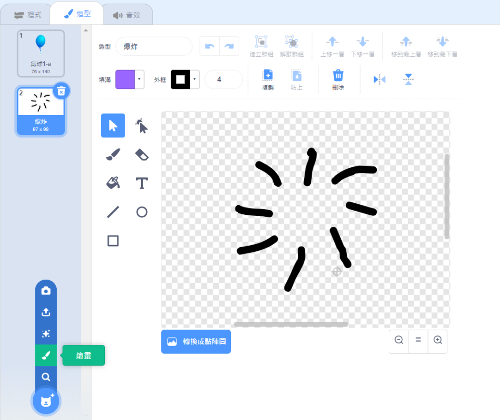

## 射擊氣球

讓我們讓玩家射擊氣球！

--- task ---

點擊你的氣球角色，然後點擊 **造型** 標籤。 你可以刪除所有其他造型，只留下一個氣球造型。 增加一個新造型，通過點擊**繪製新造型** 然後創造一個名為`爆炸`的新造型。



--- /task ---

--- task ---

遊戲開始時，確保你的氣球切換到正確的造型。 你的程式應該會像這樣：


```blocks3
when flag clicked
+switch costume to (氣球1-a v)
point in direction (pick random (-90) to (180))
go to x:(pick random (-150) to (150)) y:(pick random (-150) to (150))
change [color v] effect by (pick random (0) to (200))
forever
    move (1) steps
    if on edge, bounce
end
```

--- /task ---

--- task ---

要允許玩家射擊一個氣球,增加這個程式碼：


```blocks3
    when this sprite clicked
    switch costume to (爆炸 v)
    start sound (pop v)
```

--- /task ---

--- task ---

測試你的專案。 你能射擊氣球嗎？ 它能按預期工作嗎？

你需要改進此程式碼，以便當氣球被點擊時,`爆炸`的造型只會短暫的顯示，然後隱藏。

你可以做通過改變你的氣球`當角色被點擊`{:class="block3events"} 程式碼如下:


```blocks3
when this sprite clicked
switch costume to (爆炸 v)
start sound (pop v)
+ wait (0.3) seconds
+ hide
```

--- /task ---

--- task ---

現在當你點擊氣球時,你把它刪除了, 你也必須增加一個 `顯示`{:class="block3looks"}方塊到程式碼的開端 `當旗子被點擊`{:class="block3events"} 。


```blocks3
when flag clicked
+ show
switch costume to (氣球1-a v)
point in direction (pick random (-90) to (180))
```

--- /task ---

--- task ---

試著再次射擊氣球,來檢查是否正常運作。

--- /task ---
