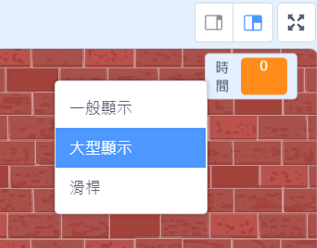

## 添加計時器

你可以讓你的遊戲更有趣，透過給予你的玩家10秒來射擊盡可能多的氣球,。

--- task ---

你可以使用另一個變數來存取剩餘的時間。 點擊舞台, 接著創造一個新變數名為`時間`{:class="block3variables"}。

--- /task ---

這是計時器的工作方式：

+ 計時器應從10秒開始計時；
+ 計時器應該每秒倒數一次；
+ 遊戲應該在計時器算到 0 的時候就停止。

--- task ---

這是執行此操作的程式碼，你可以將其增加到你的_舞台_ ：


```blocks3
when flag clicked
set [time v] to [10]
repeat until <(time) = [0]>
    wait (1) seconds
    change [time v] by (-1)
end
stop [all v]
```

--- /task ---

--- task ---

將“時間”變數顯示拖到舞台的右側。 您也可以右鍵單擊變數顯示，然後選擇“大讀數”以更改時間的顯示方式。



--- /task ---

--- task ---

測試你的遊戲。 你可以得幾分？ 如果你覺得遊戲太簡單了，你可以：

+ 給玩家更少的時間;
+ 有更多的氣球；
+ 使氣球運動更快；
+ 縮小氣球。

玩幾次你的遊戲直到你感到開心它在正確的難度。

--- /task ---

